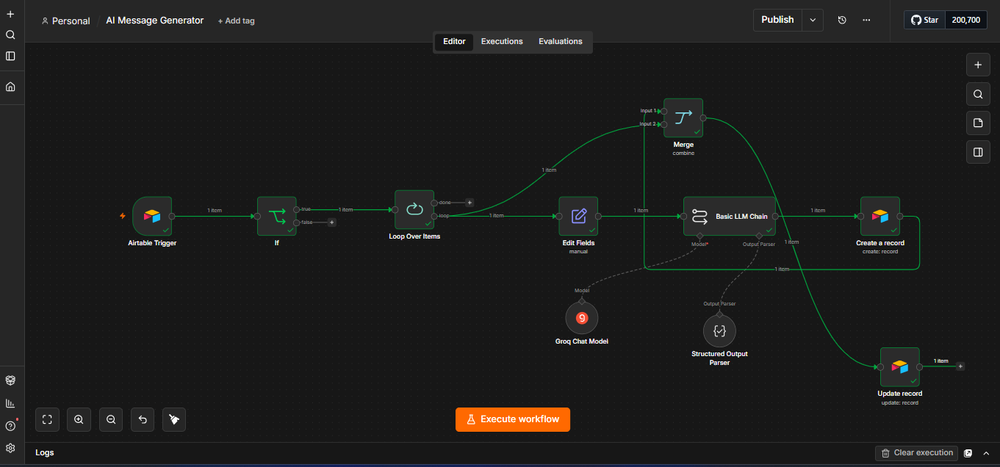

# AI AUTOMATION ENGINEER
AI Agents · Workflow Orchestration · APIs · Business Automation
---
# 👋 Hi, I'm William Njoku

I build AI-powered workflows and automation systems that connect LLMs, APIs, business tools, and data to automate complex processes.

My focus is on turning repetitive, multi-step workflows into reliable systems with structured AI outputs, conditional logic, integrations, and automated execution.

I enjoy designing workflow automations, integrating APIs, developing Python-based solutions, and creating analytics dashboards that help businesses operate more efficiently. My experience spans AI automation, CRM implementation, business intelligence, and process optimization.

### 🚀 What I work with

* Python
* AI Automation
* Make.com & n8n
* SQL
* Power BI
* REST APIs
* Git & GitHub
* CRM Platforms (Freshworks, HubSpot, Zoho)

### 📌 What you'll find here

* AI automation workflows
* Python automation projects
* API integration examples
* CRM implementation solutions
* Power BI dashboards
* Data analytics projects
* Process automation tools

I'm always exploring new AI technologies and building solutions that solve real business problems through automation and data.

**Let's connect and build something impactful.**

---

# TECHNICAL STACK

AI & LLMs
Claude · OpenAI · Groq · Prompt Engineering · Structured Outputs

Automation & Orchestration
n8n · Make · Workflow Design · Conditional Logic · Webhooks

Integrations
REST APIs · JSON · Airtable · CRM Systems

Development & Data
Python · SQL · Git/GitHub

Business Systems
HubSpot · Freshworks · Zoho · Power BI

---

# MY PROJECTS 
*Check out some of the projects I've been working on.* 😁

**RWA Inc — AI Message Drafter**

An AI-powered outbound messaging automation workflow built with n8n, Airtable, and LLM orchestration as part of the RWA Inc Autonomous Outbound System.
The workflow automates the transition from a qualified prospect record to structured, personalized outreach messages while maintaining lead context, qualification logic, and processing state.
Documentation: [Read More](https://docs.google.com/document/d/1trN7DybOa215AEq32HHpfE_b--StXX1sgw3Z3XM9GP8/edit?usp=sharing)

Demo clip: Can be found on LinkedIn ----> [Read More](https://www.linkedin.com/posts/activity-7495582971958128640-ZjLZ?utm_source=share&utm_medium=member_desktop&rcm=ACoAAD-1MIMBskxuJA86RKfxfpX_fFbhc-ELA3o) 

**AI-Powered Outbound Automation System**
AI Automation Engineering | n8n · Airtable · LLM APIs
.png)
Built and hardened an AI-powered outbound workflow that transforms qualified leads into personalized, channel-aware first-touch messages. Implemented structured AI output validation, deterministic compliance checks, conditional channel routing, Airtable persistence, and workflow state management. 
Documentation: [Read More](https://docs.google.com/document/d/1Bpl2MSHgduL5cA4ChKPdKrcakBZjd3221HWEwmqH-Ak/edit?usp=sharing) 

**CRM-Customer Support Automation**
 
Designed and implemented a customer support ticket automation workflow using Make.com, Airtable, Gmail, and Slack to streamline ticket routing, customer communication, and internal support operations.
For full documentation, 
Documentation: [Read More](https://docs.google.com/document/d/1UOj_r8OkzTtBSi95QLr2KXgx-cRPfahOIkdDlCtoqe8/edit?usp=sharing) 

**AI-powered call assistant workflow integrated with Vapi and automation tools.**
 
Designed and implemented an automated lead qualification and customer communication workflow using Make.com, Airtable, Vapi AI, Gmail, Slack, and CRM-based processes.
The system automates outbound lead engagement, internal notifications, and CRM updates to improve operational efficiency and lead tracking.
Documentation: [Read More](https://docs.google.com/document/d/1e2m5u_2qGY1WVNipI9uMnxdvz6wiLt5kJQoL2NZOI9A/edit?usp=sharing) 

## CONTACT DETAILS

*Let’s connect and see how we can make a difference together!*
<table>
  <tbody>
    <tr>
      <td>📧</td>
      <td><a href="mailto:Williamnjoku007@gmail.com">Williamnjoku007@gmail.com</a></td>
    </tr>
    <tr>
      <td>📞</td>
      <td>(234) 903-274-6686, 09133806099</td>
    </tr>
    <tr>
      <td>📍</td>
      <td>Lagos, Nigeria</td>
    </tr>
    <tr>
      <td>⬇️</td>
      <td><a href="William_Njoku Data & CRM (3).pdf">Download my CV</a></td>
    </tr>
    <tr>
      <td>🌐</td>
      <td><a href="https://linkedin.com/in/william-njoku-143b51259">The things I do daily on LinkedIn</a></td>
    </tr>
    <tr>
